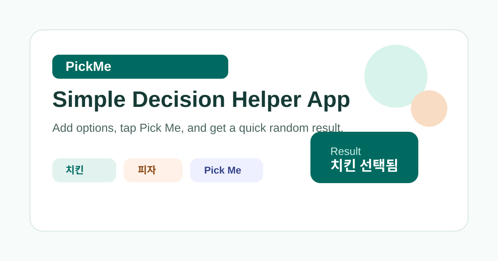
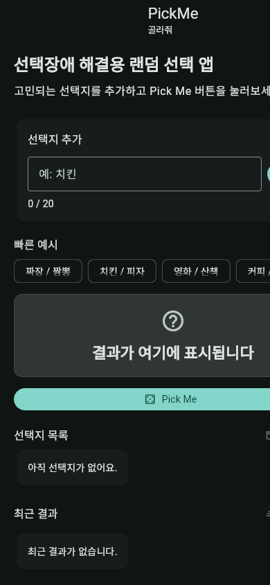

# PickMe

Simple Decision Helper App

PickMe is a small open-source Flutter app for quick random decisions. Add a few options, tap **Pick Me**, and let the app choose one result.

## Features

- Random Decision Picker
- Multiple Options
- Decision History
- Material Design UI

## App Preview



## Screenshots

| Home |
| --- |
|  |

## Tech Stack

- Flutter
- Dart

## Getting Started

```bash
flutter pub get
flutter run
```

## Privacy

No account required.

No personal information collected.

No analytics.

No ads.

No payments.

## Future Plans

- Wheel Mode
- Team Decision Mode
- Tournament Mode

See the full roadmap in [docs/ROADMAP.md](docs/ROADMAP.md).

## Documentation

- [Project Overview](docs/PROJECT_OVERVIEW.md)
- [Privacy](docs/PRIVACY.md)
- [Roadmap](docs/ROADMAP.md)
- [Maintenance Automation](docs/MAINTENANCE_AUTOMATION.md)
- [Contributing](CONTRIBUTING.md)

## License

This project is licensed under the MIT License.
